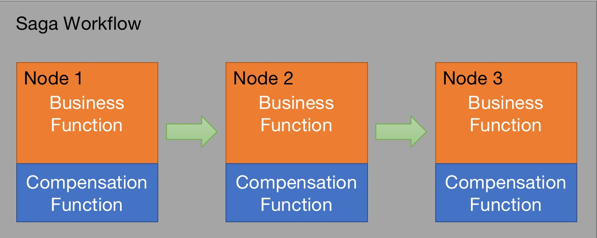

# IC-Saga

Saga State Machine is designed to solve distributed transaction problems. 

Each Saga workflow describes a long lived transaction with a group of sequential sub-transactions, and each sub-transaction has a compensation method to cancel the result of current sub-transaction. So if there is no exception, the sub-transactions will be done in order. And if any fails, the compensation methods will be invoked one by one in a reverse order.



A demo of how to define a Saga workflow
```
https://f2esa-zyaaa-aaaak-aee5q-cai.ic0.app
```

## Attribute

### Name
One name defines one workflow, and it's unique under one user principal. If you submit a workflow with an existed name, the existed workflow will be updated.

### Description
To describe the workflow, optional.

### Node
One node is one sub-transaction. One workflow has a group of nodes, and they are sequential.
- Node-Name: Each node name is unique in one workflow.
- Node-CanisterID: The canister id which will be used in currentnode.
- Node-FunctionName: The function name which will be invoked incurrent node.
- Node-CompensateFunctionName: The compensation function of this node which will be invoked if the workflow failed.

## Standard

### Method name
Any method name is ok, just for Saga to invoke.

### Input parameter
An array of enumeration-value mapping, to cover different types or quantities of input parameters.

### Output parameter
Only 'true' or 'false'. 

The Saga workflow will use this result to decide what action will be done next. If true, continue to run next node. If false or throws a exception, call the compensation functions in a reverse order from current node.